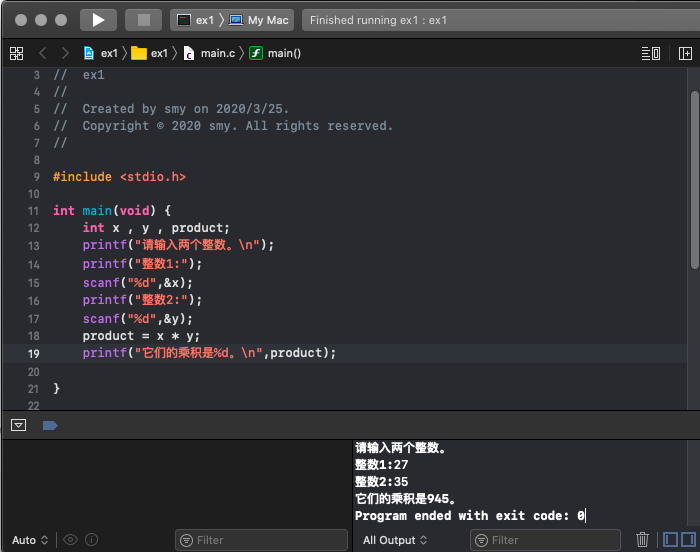

# 作业

## 上午作业
当i增加到17的时候，fact出现负数，之后出现数字不规律，当i增加到34的时候，fact变为0，之后一直为0
c语言中int最大值为2^31 = 2147483647


## 下午作业

1-8
```
#include <stdio.h>

int main(void) {
    int x , y , product;
    printf("请输入两个整数。\n");
    printf("整数1:");
    scanf("%d",&x);
    printf("整数2:");
    scanf("%d",&y);
    product = x * y;
    printf("它们的乘积是%d。\n",product);
}
```




1-9

```
#include <stdio.h>

int main(void) {
    int x , y , z , sum;
    printf("请输入三个整数。\n");
    printf("整数1:");
    scanf("%d",&x);
    printf("整数2:");
    scanf("%d",&y);
    printf("整数3:");
    scanf("%d",&z);
    sum = x + y + z;
    printf("它们的和是%d。\n",sum);
 
}
```


