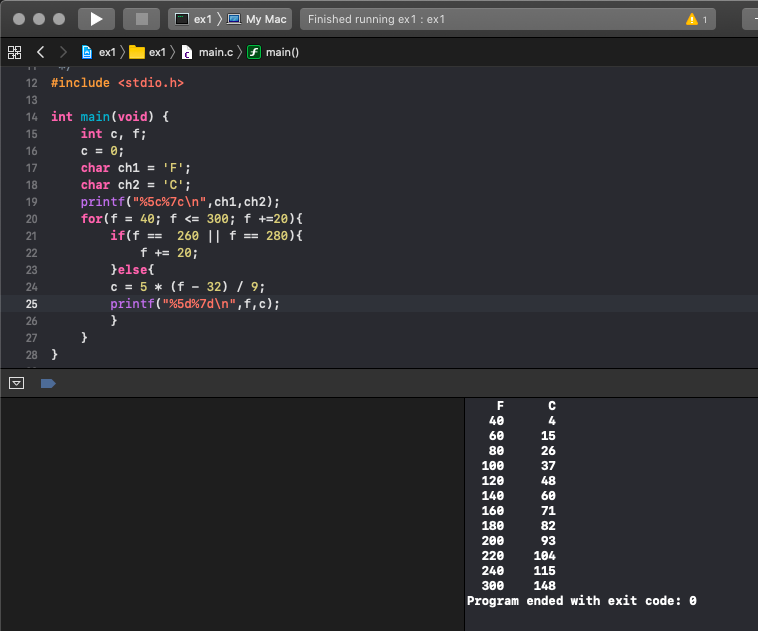
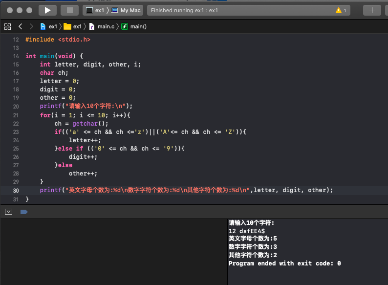

# 3.27作业

## 上午作业

1. 优化
    ```
    #include <stdio.h>

    int main(void) {
        int i, product,tmp;
        tmp = 1;
        product = 0;
        for (i = 1; i <= 10; i++){
            product = tmp * i;
            tmp = product;
            printf("%d的阶乘为%d\n", i, product);
        }
    }
    ```
1. 打印温度表
    ```
    #include <stdio.h>

    int main(void) {
        int c, f;
        c = 0;
        char ch1 = 'F';
        char ch2 = 'C';
        printf("%5c%7c\n",ch1,ch2);
        for(f = 40; f <= 300; f +=20){
            if(f ==  260 || f == 280){
                f += 20;
            }else{
            c = 5 * (f - 32) / 9;
            printf("%5d%7d\n",f,c);
            }
        }
    }
    ```
    


1. 月份
    ```
    #include <stdio.h>

    int main(void) {
        int month;
        printf("请输入一个月份:\n");
        scanf("%d", &month);
        if ((month >= 1 && month <= 7 && month % 2 == 1)||(month >= 8 && month <= 12 && month % 2 == 0)) {
            printf("%d月的天数为%d天\n",month,31);
        }else if (month == 2){
            printf("%d月的天数为%d天\n",month,28);
        }else if(month <= 1 || month >= 12){
            printf("你输入的不是月份。\n");
        }
        else{
            printf("%d月的天数为%d天\n",month,30);
        }
    }
    ```

1. 输入10个字符，统计其中的英文字母、数字字符和其他字符的个数。

    ```
    #include <stdio.h>

    int main(void) {
        int letter, digit, other, i;
        char ch;
        letter = 0;
        digit = 0;
        other = 0;
        printf("请输入10个字符:\n");
        for(i = 1; i <= 10; i++){
            ch = getchar();
            if(('a' <= ch && ch <='z')||('A'<= ch && ch <= 'Z')){
                letter++;
            }else if (('0' <= ch && ch <= '9')){
                digit++;
            }else
                other++;
        }
        printf("英文字母个数为:%d\n数字字符个数为:%d\n其他字符个数为:%d\n",letter, digit, other);
    }
    ```
    

## 下午作业


