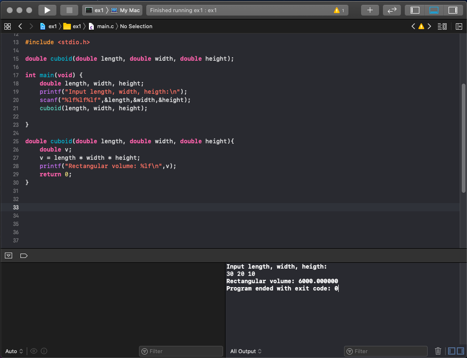
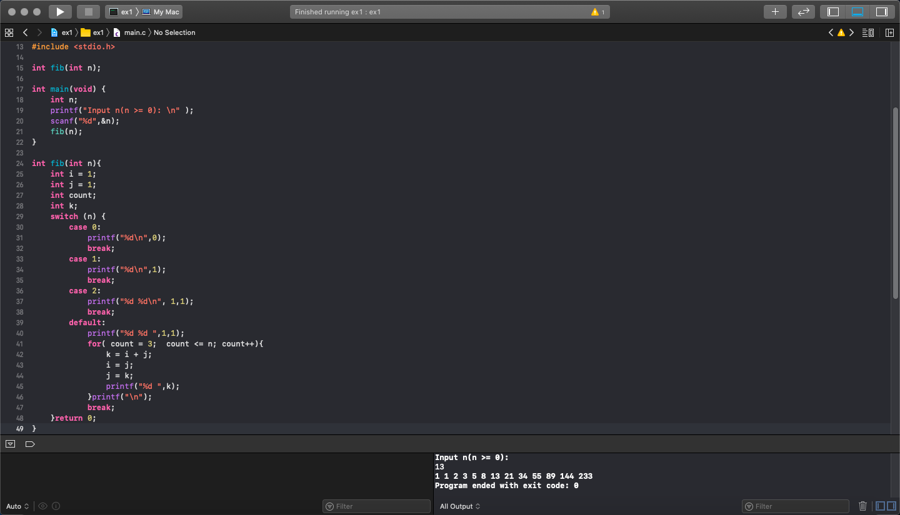
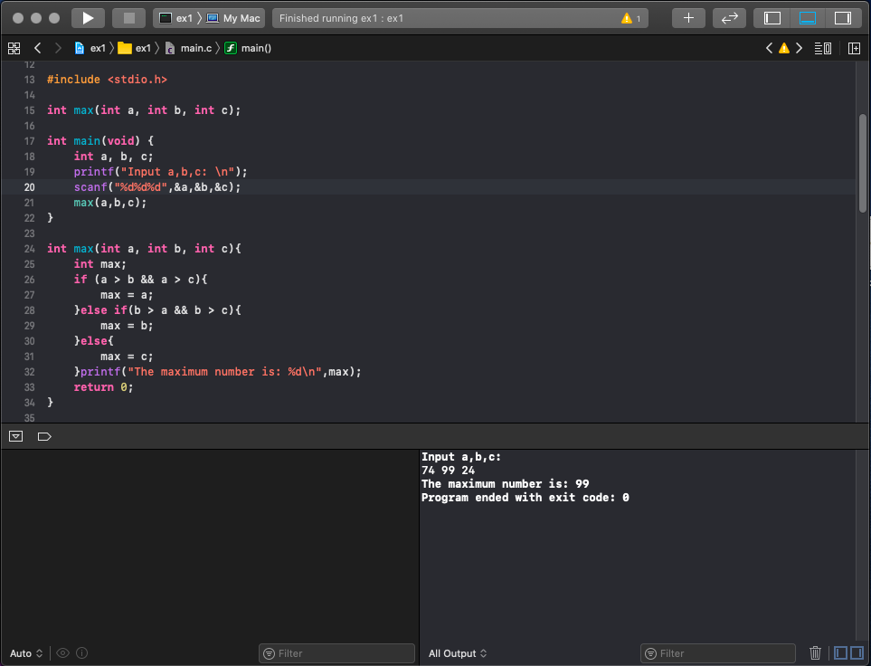

# 作业

1. 计算长方体体积函数
```
#include <stdio.h>

double cuboid(double length, double width, double height);

int main(void) {
    double length, width, height;
    printf("Input length, width, heigth:\n");
    scanf("%lf%lf%lf",&length,&width,&height);
    cuboid(length, width, height);
    
}
    
double cuboid(double length, double width, double height){
    double v;
    v = length * width * height;
    printf("Rectangular volume: %lf\n",v);
    return 0;
}
```


2. 实现第n项斐波拉契数列的函数(n>0)
```
#include <stdio.h>

int fib(int n);

int main(void) {
    int n;
    printf("Input n(n >= 0): \n" );
    scanf("%d",&n);
    fib(n);
}

int fib(int n){
    int i = 1;
    int j = 1;
    int count;
    int k;
    switch (n) {
        case 0:
            printf("%d\n",0);
            break;
        case 1:
            printf("%d\n",1);
            break;
        case 2:
            printf("%d %d\n", 1,1);
            break;
        default:
            printf("%d %d ",1,1);
            for( count = 3;  count <= n; count++){
                k = i + j;
                i = j;
                j = k;
                printf("%d ",k);
            }printf("\n");
            break;
    }return 0;
}

```



3. 实现计算三个数中最大值的函数
```
#include <stdio.h>

int max(int a, int b, int c);

int main(void) {
    int a, b, c;
    printf("Input a,b,c: \n");
    scanf("%d%d%d",&a,&b,&c);
    max(a,b,c);
}

int max(int a, int b, int c){
    int max;
    if (a > b && a > c){
        max = a;
    }else if(b > a && b > c){
        max = b;
    }else{
        max = c;
    }printf("The maximum number is: %d\n",max);
    return 0;
}

```
