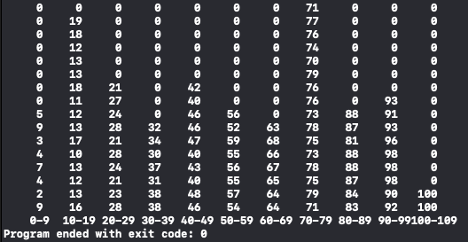

# 作业

## 上午作业

```
#include <stdio.h>

int main ()
{
    char c;
    while ((c =getchar()) != EOF) {
        if(c >= 'a' && c <= 'z'){
            c = c + 'A' - 'a';
        }else if (c >= 'A' && c <= 'Z'){
            c = c + 'a' - 'A';
        }
        printf("%c",c);
    }
}
```

## 下午作业
```
#include <stdio.h>
#include <time.h>
#include <stdlib.h>


int main (){
    // 生成100个随机数的数组, 分布到0-100
    srand((unsigned int)time(NULL));
    int a[100];
    for (int i = 0; i < 100; i++) {
        a[i] = rand() % 101;
    }
    
    for (int i = 0; i < 100; ) {
        printf("%4d", a[i]);
        i++;
        if (i%10 == 0) {
            printf("\n");
        }
    }
    //求二维数组b的行数 q行
    int q = 0;
    for(int v = 0; v < 10; v++){
        int tmp = 0;
        for(int i = 0; i < 100; i++){
            if(a[i] >= v * 10 && a[i] <= v * 10 + 9){
                tmp++;
            }
        }
        if(tmp >= q){
            q = tmp;
        }
    }
    
    printf("二维数组b有%d行\n",q);
    
    //将数组a中的数放入数组b中
    int b[q][11];
    int c, count;
    for(c = 0; c < 11; c++){
        count = q - 1;
        for(int j = 0; j < 100; j++){
            if(a[j] <= c * 10 + 9 && a[j] >= c * 10){
                b[count][c] = a[j];
                count--;
            }
        }
        //将剩下位数补零
        while (count >= 0) {
            b[count][c] = 0;
            count--;
        }
    }
    
    //打印数组
    for(int x = 0; x < q; x++){
        for(int y = 0; y < 11; y++){
            printf("%6d",b[x][y]);
        }
        printf("\n");
    }
    
    //打印底部
    printf("    0-9 ");
    for (int i = 1; i < 11; i++)
    {
        printf("%3d-%d", i * 10, i * 10 + 9);
    }
    printf("\n");
}
```


