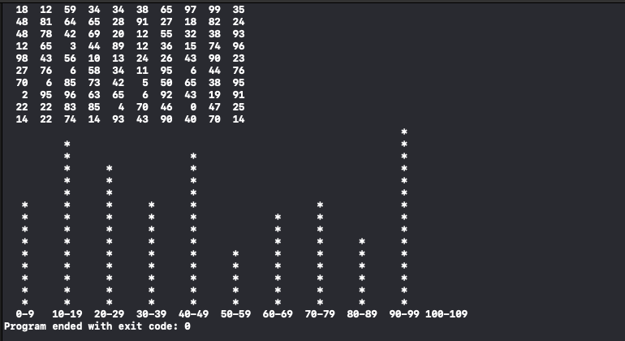

# 作业
```
#include <stdio.h>
#include <time.h>
#include <stdlib.h>


int main (){
    // 生成100个随机数的数组, 分布到0-100
    srand((unsigned int)time(NULL));
    int a[100];
    for (int i = 0; i < 100; i++) {
        a[i] = rand() % 101;
    }
    
    for (int i = 0; i < 100; ) {
        printf("%4d", a[i]);
        i++;
        if (i%10 == 0) {
            printf("\n");
        }
    }
    
    //将每段有几个数统计到数组b[]中
    int b[11] = {0};
    for(int j = 0; j < 11; j++)
        for(int i = 0; i < 100; i++){
            if(a[i] >= j * 10 && a[i] <= j * 10 + 9){
                b[j]++;
            }
        }
    
    /*
    for(int i = 0; i < 11; i++){
        printf("%d  ",b[i]);
    }printf("\n");
    */
    
    //找出其中最大的数
    int tmp = 0;
    for(int i = 0; i < 11; i++){
        if(tmp < b[i])
            tmp = b[i];
    }//printf("%d\n",tmp);
    
    //打印*
    int n = tmp;
    for(int i = 0; i < tmp; i++){
        for(int j = 0; j < 11; j++){
            if(b[j] < n){
                printf("       ");
            }else{
                printf("   *   ");
            }
        }
        n--;
        printf("\n");
    }
    
    //打印底部
    printf("  0-9  ");
    for(int i = 1; i < 11; i++){
        printf("%3d-%2d ", i * 10, i * 10 + 9);
    }printf("\n");
}

```

