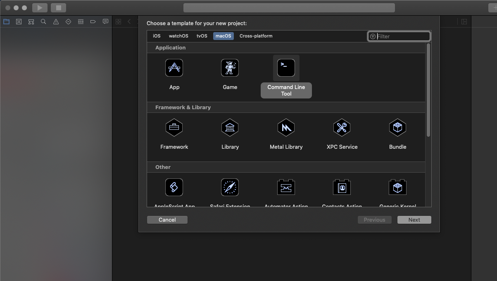
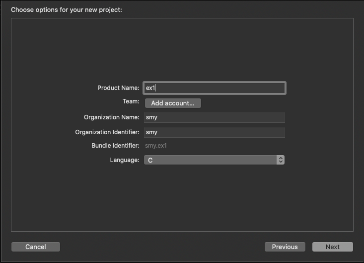
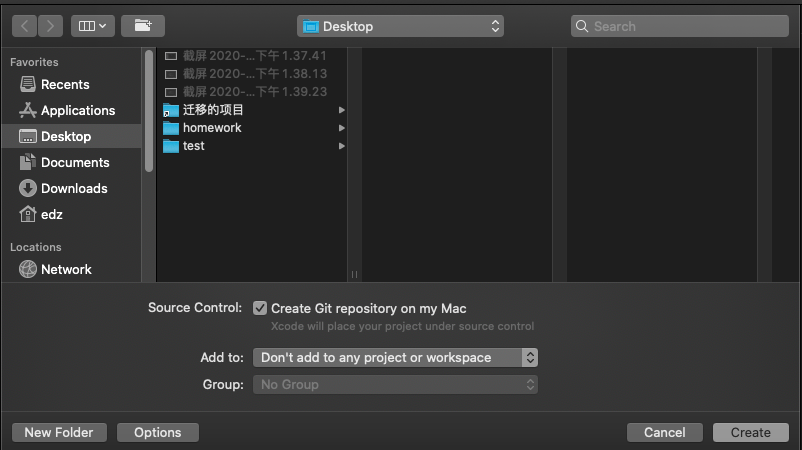
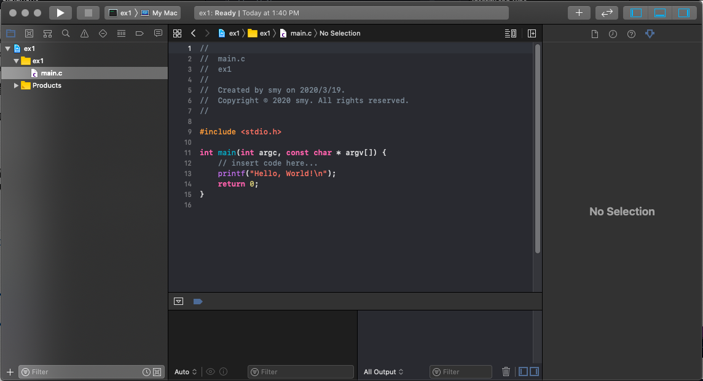
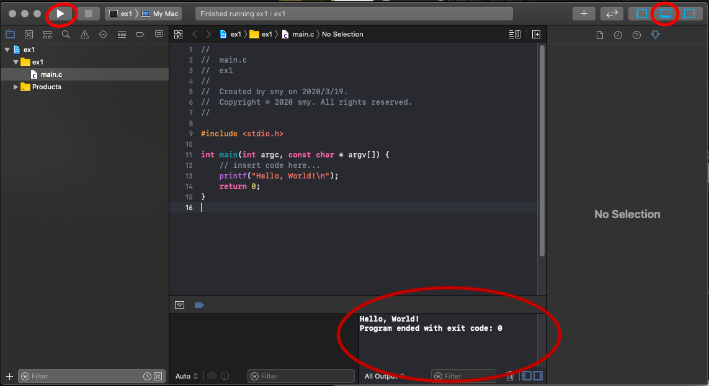
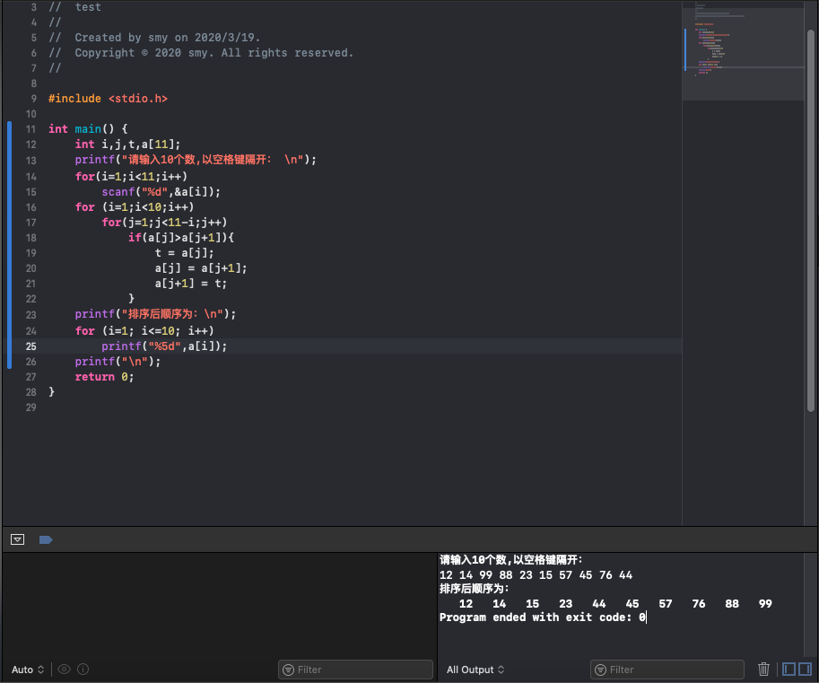

# C语言相关

## 安装xcode
1. 在APP Store中找到xcode，点击安装

1. 创建新项目

选择command Line Tool，点击next，进入下一步

1. 设置项目名称、使用语言等

1. 选择保存位置

1. 创建完成之后点击main.c进入编辑界面

1. 编辑程序，完成后点击界面左上角三角形按钮，运行程序

左上角按钮代表运行，右上角按钮表示调出运行结果显示框，如图中下方所示

## 作业截图

