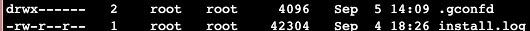
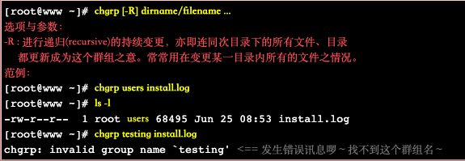
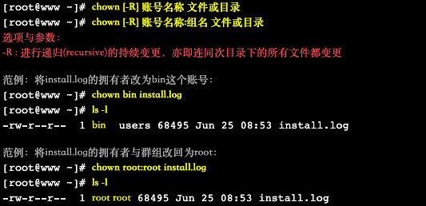
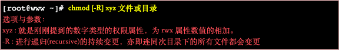
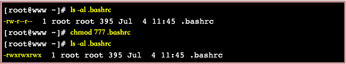
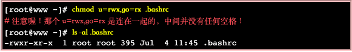
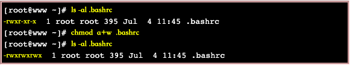
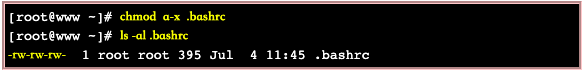

# linux相关

文件拥有者可以设置文件属性即不同使用者使用权限<br>
群组中可以设置同一群组中成员对文件的权限，同时也可以阻止非本群组成员的访问

注：root权限最大

linux中
- 一般身份使用者以及root信息存储在/etc/passwd中
- 个人密码存储在/etc/shadow中
- 组名存储在/etc/group中




## 1、了解 " -rwxr-xr-- "含义<br>
将其分解为以下几个部分<br>
[ - ][ rwx ][ r-x ][ r-- ]

第一个[ - ]代表文件或目录
- 当为[ d ]时为目录
- 当为[ - ]则是文件，例如上表档名为『install.log』那一行；
- 若是[ l ]则表示为连结档(link file)；
- 若是[ b ]则表示为装置文件里面的可供储存的接口设备(可随机存取装置)；
- 若是[ c ]则表示为装置文件里面的串行端口设备，例如键盘、鼠标(一次性读取装置)。

``` r-read w-write x-execute ```<br>

第二个[ rwx ]为文件拥有者权限<br>
‘r’ 代表可读<br>
‘w’ 代表可写<br>
‘x’ 代笔可执行<br>

第三个[ r-x ]为同群组权限<br>
‘r' 代表可读<br>
‘-‘ 代表不可写<br>
‘x’ 代表可执行<br>

第四个[ r-- ]
‘r' 代表可读<br>
‘-‘ 代表不可写<br>
‘-’ 代表不可执行<br>

注：rwx顺序不变，没有该权限则会变成'-'

## 2、上图中 ‘2’代表有多少档名连接到此节点！！
目录树是使用文件名来记录， 每个档名就会连结到一个i-node

## 3、第三栏表示这个文件的【拥有者账号】

## 4、第四栏表示这个文件的所属群组
所属群组权限在1中有介绍

## 5、第五栏为这个文件大小，单位：bytes

## 6、第六栏为这个文档建档日期或者修改日期
如果这个文件被修改的时间距离现在太久了，那么时间部分会仅显示年份而已<br>
使用```ls -l --full-time```能够显示出完整的时间格式了包括年、月、日、时间

## 7、第七栏为这个文件档名
若档名之前多一个' . '，则代表这个文件为『隐藏档』

# 文件权限重要性
1. 系统保护功能
    e.g：重要文件例如/etc/shadow，只有root才能读取，因此应该为[-rw-------]
1. 团队开发软件或数据共享功能
    e.g：若团队中有成员需要对文件进行操作，便要具有可读，可写，可执行，因此为[-rwxrwx---]
1. 未将权限设定妥当的危害
    e.g：系统可能会被其他人恶意篡改

# 改变文件属性以及权限
命令行 | 作用
---| ---
chgrp (change group) | 改变文件所属群组
chown (change owner) | 改变文件拥有者
chmod (change mode) | 改变文件权限，SUID，SGID，SBIT等特性

## 1.改变文件所属群组——chgrp

被改变的组名一定要在/etc/group，否则显示错误



users本身存在于/etc/group中，而testing不存在，使用chgrp更改install.log文件所属群组。结果如上图所示，users更改成功，而testing更改失败，提示找不到群组名

## 2.改变文件拥有者——chown

被改变的用户名一定要在/etc/passwd中，同时，此命令还可以更改群组名称。



结果如图所示

注：chown也可以使用```chown user.group file```，亦即在拥有者与群组间加上小数点『.』也行！ 不过很多朋友设定账号时，喜欢在账号当中加入小数点(例如vbird.tsai这样的账号格式)，这就会造成系统的误判了！ 所以我们比较建议使用冒号『:』来隔开拥有者与群组啦！此外，chown也能单纯的修改所属群组呢！ 例如```chown .sshd install.log```就是修改群组。就是那个小数点的用途！

chgrp和chown经常在将文件复制给他人时使用

## 3.改变权限——chmod
可以使用数字或者符号进行权限变更，linux中

- r:4
- w:2
- x:1

### 3.1 chmod使用数字变更权限



1、例如，将.bashrc这个文件所有权限都设置为启用，操作如图所示



2、将.bashrc这个文件改为-rw-r--r--
指令为``` chmod 644 .bashrc ```

### 3.2 chmod使用符号变更权限
- u-user
- g-group
- o-others
- a-all
- +(加入)
- -(除去)
- =(设定)

1、例如将.bashrc这个文件设置为-rwxr-xr-x



2、例如并不知道.bashrc文件权限，要使每个人都具有写入这一权限



3、若去掉所有人可执行权限



## 权限对文件重要性

- r ：可读此文件实际内容；
- w ：可以编辑、新增或修改文件内容（但是不能删除）
- x ：该文件具有被系统执行权限

## 权限对目录重要性

- r ：能够读取目录结构列表权限，即可以查询该目录下文件名数据
- w ：具有write权限可以做到以下事情
    - 建立新的文件以及目录
    - 删除以及存在的文件与该目录（无论文件权限如何）
    - 将已经存在的文件或目录进行更名
    - 搬移该目录内的文件、目录位置

也就是说具有该目录权限可以将该目录下文件进行操作

- x ：此权限决定你是否可以进入到该目录下


## 文件种类

- 正规文件
    - 纯文本文档（ASCLL）：人类可以直接读到数据
    - 二进制文件（binary）：系统可读取文件
    - 数据格式文件（data）：有些程序在运作的过程当中会读取某些特定格式的文件，那些特定格式的文件可以被称为数据文件 (data file)

- 目录（directory）：第一个属性为d

- 连接档（link）：类似于Window下快捷方式，第一个属性为[l](小写L)

- 设备与装置文件(device)：与系统周边及储存等相关的一些文件， 通常都集中在/dev这个目录之下！通常又分为两种：
    - 区块(block)设备档 ：就是一些储存数据， 以提供系统随机存取的接口设备，举例：硬盘与软盘

    - 字符(character)设备文件：亦即是一些串行端口的接口设备， 例如键盘、鼠标等等！这些设备的特色就是『一次性读取』的，不能够截断输出。 举例来说，你不可能让鼠标『跳到』另一个画面，而是『滑动』到另一个地方啊！第一个属性为 [ c ]。

- 数据接口文件(sockets):通常被用在网络上的数据承接,第一个属性为 [ s ]， 最常在/var/run这个目录

 - 数据输送文件(FIFO,pipe)：FIFO也是一种特殊的文件类型，他主要的目的在解决多个程序同时存取一个文件所造成的错误问题。 FIFO是first-in-first-out的缩写。第一个属性为[p] 。

设备文件较为重要，不要轻易修改

## 扩展名
linux中并没有扩展名这一说法，能否被执行应该看是否具有x权限，但是我们可以通过“扩展名”来了解该文件是什么种类的，下面几个常用的扩展名：
- *.sh ： 脚本或批处理文件 (scripts)，因为批处理文件为使用shell写成的，所以扩展名就编成 .sh ；

- *Z, *.tar, *.tar.gz, *.zip, *.tgz： 经过打包的压缩文件。这是因为压缩软件分别为 gunzip, tar 等等的，由于不同的压缩软件，而取其相关的扩展名啰！

- *.html, *.php：网页相关文件，分别代表 HTML 语法与 PHP 语法的网页文件啰！ .html 的文件可使用网页浏览器来直接开启，至于 .php 的文件， 则可以透过 client 端的浏览器来 server 端浏览，以得到运算后的网页结果呢！

## linux文档名长度限制

- 单一文件或目录的最大容许文件名为 255 个字符；

- 包含完整路径名称及目录 (/) 之完整档名为 4096 个字符。

注：多使用tap键

## linux文件名限制：
要避免以下字符<br>  * ? > < ; & ! [ ] | \ ' " ` ( ) { } 

