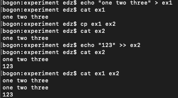
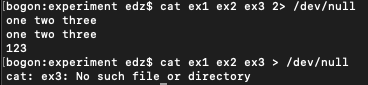
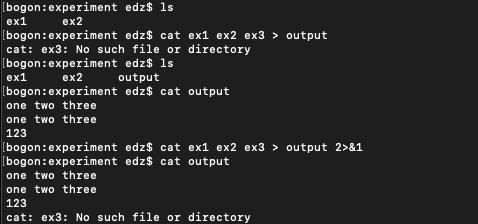
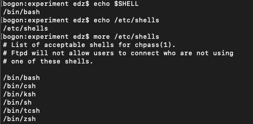
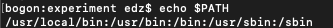

# shell文件相关
## 文件重定向

- 标准输入 0
- 标准输出 1
- 错误输出 2

符号 | 含义 | 示例
:-: | :- | :-
` > `| 标准输出重定向到文件 | `echo "ABCD" > 1.txt `
` >> `| 标准输出追加到文件 | ` echo "EFGH" >> 1.txt `
` 2> `| 错误输出重定向到文件 | ` cat not-exist-file 2 > 1.txt `
` 2>&1 `| 错误输出重定向到标准输出 | `ls -la not-exist-file 1.txt > 1.txt 2>&1 `

` > ` 和 ` >> `区别在于 `>`会将原文件内容覆盖，而` >> ` 会在原文件内容后添加

` > ` 和 ` >> `示例

` > ` 、` 2> `示例

` 2>&1 `示例

如上图所示，`2>&1`是指将错误输出也放入标准输出文件中，图中就是output文件

## shell文件
第一行一般是指用什么文件来执行shell文件
之后将操作输入

查看哪些shell可以使用的命令，如图所示

第一行格式

示例：  #!/bin/bash

系统中命令一般存储在PATH中，如图所示

路径用’:‘隔开，图中共有5个PATH，当输入指令时，系统会在这些路径中找，如果找不到，系统则认为输入的为乱码，因此要告诉系统所编写脚本文件在哪

执行脚本要告诉系统shell文件在哪 
例如，demo.sh如果在当前文件夹中，可以使用./demo.sh(要注意脚本文件是否有执行权限)

