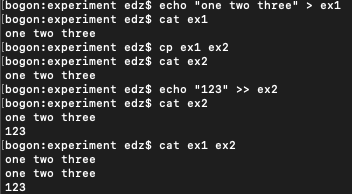
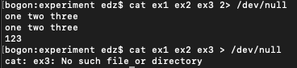
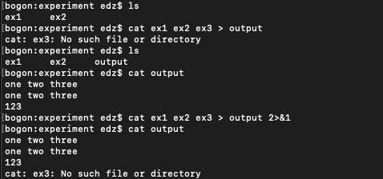
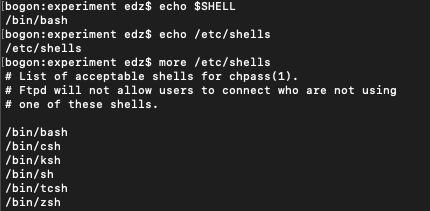
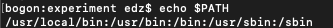
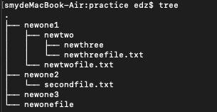
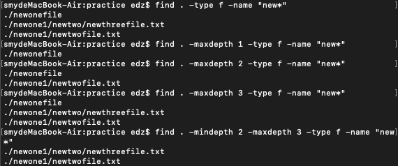
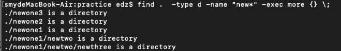
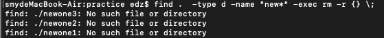
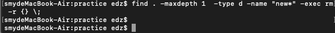

# shell文件相关
## 文件重定向

- 标准输入 0
- 标准输出 1
- 错误输出 2

符号 | 含义 | 示例
:-: | :- | :-
` > `| 标准输出重定向到文件 | `echo "ABCD" > 1.txt `
` >> `| 标准输出追加到文件 | ` echo "EFGH" >> 1.txt `
` 2> `| 错误输出重定向到文件 | ` cat not-exist-file 2 > 1.txt `
` 2>&1 `| 错误输出重定向到标准输出 | `ls -la not-exist-file 1.txt > 1.txt 2>&1 `

` > ` 和 ` >> `区别在于 `>`会将原文件内容覆盖，而` >> ` 会在原文件内容后添加

` > ` 和 ` >> `示例

` > ` 、` 2> `示例

` 2>&1 `示例

如上图所示，`2>&1`是指将错误输出也放入标准输出文件中，图中就是output文件

## shell文件
第一行一般是指用什么文件来执行shell文件
之后将操作输入

查看哪些shell可以使用的命令，如图所示

第一行格式

示例：  #!/bin/bash

系统中命令一般存储在PATH中，如图所示

路径用’:‘隔开，图中共有5个PATH，当输入指令时，系统会在这些路径中找，如果找不到，系统则认为输入的为乱码，因此要告诉系统所编写脚本文件在哪

执行脚本要告诉系统shell文件在哪 
例如，demo.sh如果在当前文件夹中，可以使用./demo.sh(要注意脚本文件是否有执行权限)

1. 在shell中单行注释：使用`# example`

1. 多行注释：使用  `:<<! example !`
(!可以替换为其他数字或字符)
1. 多行注释：使用  `:' example ' `

## find 命令

find命令用来查找文件(夹)，同时也可以对文件(夹)进行操作

示例： 
` find . -type f -name "*.md" -exec more {} \; `

find后
- . 表示当前文件夹，此处应该表明在哪寻找，可替换为其他目录
    - 示例 如在home文件夹下，要查阅experiment文件夹下以ex为开头的文件，使用命令为
    ` find experiment -type f -name "ex*" -exec more {} \; `
- -type 后表示文件种类'd'表示目录，'f'表示文件
- -name 后表示文件名，'*.md'表示以.md结尾的所有文件
- -exec 后表示要执行的命令
-  `{} \; `固定格式

遍历搜索最大深度 ` -maxdepth ` 
遍历搜索最小深度 ` -mindepth `

当前文件中内容如下

示例： 

### 若要操作文件夹，则需要指定遍历搜索最大深度

示例

使用find读取文件夹

能够读取成功

使用find删除文件夹

系统显示错误，此时需要用到`maxdepth`

系统没有报错

其他命令

- -mtime(modify) 
- -ctime(create) 
- -atime(access)
    - 参数`+`表示在此内,`-`表示在此之外

- -newer 
用来比较文件修改时间,用 ! 来表示逻辑非, 
示例 
` find ./ -newer new1 ` 查找比new1建立晚的文件 
` find ./ ! -newer new1 ` 查找比new1建立早的文件

- -ok 
用法同-exec，但是会提示是否执行该命令

- -mount 
只查找当前文件系统，不进去其他文件系统，很有用，不会在你其他加载的fat32磁盘，光盘或nfs文件系统去搜索

