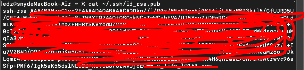
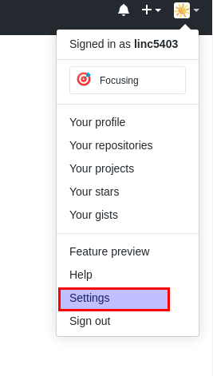
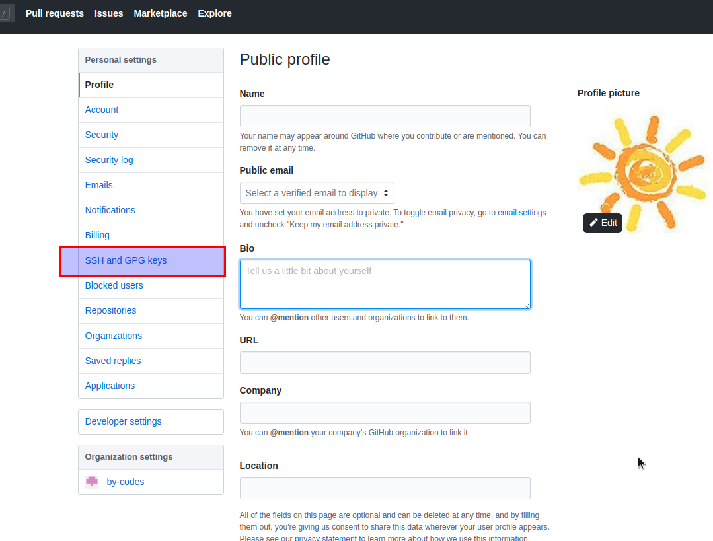
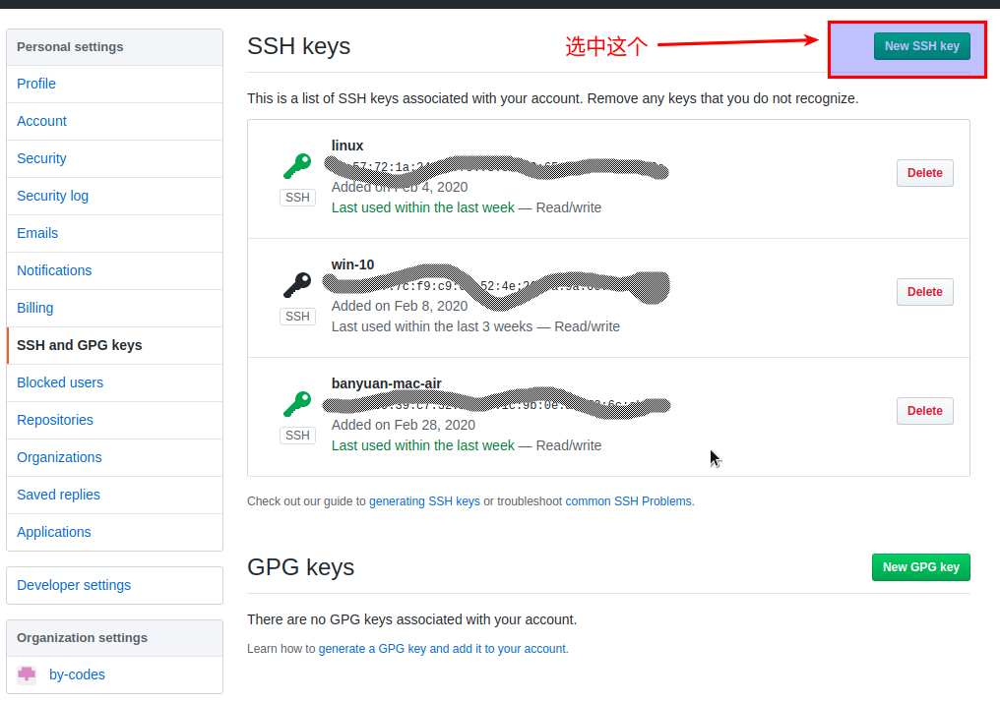
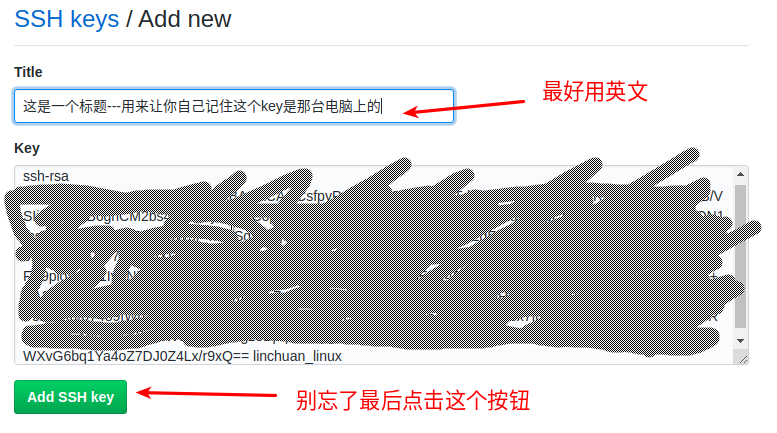
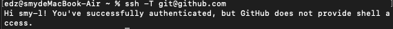

# 学会使用command+space调出聚焦搜索
terminal 终端（也可以使用其调用其他软件）

# 浏览器
Chrome浏览器，搜索引擎使用Google（多使用英文搜索）

# 常用命令行
命令行 | 作用
--- | ---
pwd             | 知道自己所在目录
cd              | 切换到home目录
cd .            | 当前目录
cd ..           | 切换到上一级目录
cd + example    | 切换到“example”目录下

<br>

查看文件信息 | 作用
--- | ---
ls              | 查看当前目录下到文件和文件夹
ls -a (all)     | 现实隐藏文件及文件夹
ls -l (long)    | 显示更多信息
ls -h (humanity)| 友好显示方式

<br>

文件、文件夹 | 作用
--- | ---
touch           | 创建一个新文件
rm (remove)     | 删除一个文件
cp (copy)       | 复制一个文件
mv (move)       | 移动或者重命名一个文件
mkdir           | 创建一个新文件夹
mkdir -p        | 依次创建目录下的文件夹
rm -r           | 删除一个文件夹
cp -r           | 复制一个文件夹
mv              | 移动或者重命名文件夹

<br>

其他 | 作用
--- | ---
history         | 查看历史命令记录
cat             | 查看文本文件内容
grep            | 过滤内容

# 命令行快捷键
```
//C ->代表control
//M ->代表option
```
快捷键 | 作用
--- | ---
C-a             | 光标移动到行首
C-e             | 光标移动到行尾
C-f             | 光标右移一个字符
C-b             | 光标左移一个字符
M-f             | 光标右移一个单词
M-b             | 光标左移一个单词
C-d             | 删除光标下的字符
M-d             | 删除光标右边单词
C-w             | 删除光标左边的单词
C-k             | 删除光标右边的所有内容
C-u             | 删除整行内容
C-p             | 上一条执行的命令
C-n             | 下一条执行的命令（需要先执行C-p才可使用）
C-r             | 搜索之前执行的命令

# 编辑器
常用的编辑器有sublime、Atom、VS-code、vim、emacs等，但是无论使用哪一个以下操作快捷键一定要熟悉
- 打开文件(command+O)<br>关闭文件(command+W)
- 光标移动（见上述）
- 删除一行，删除一个词（见上述）
- 复制粘贴（command+C、command+V）

暂定使用vscode(操作sublime较为简单)

# brew (软件管理)
命令行 | 作用
--- | ---
brew list       | 查看已经安装的软件
brew install    | 安装软件
brew uninstall  | 卸载软件
brew search     | 查询可供安装的软件


# git
远端 (github) | 本地(mac)
--- | ---
账号(注册，一次完成) | 认证(每台电脑需要一次)
创建项目|操作项目 管理项目

## github的使用

1. 创建账号
1. 配置` ssh-key `（网站上操作）<br>
    配置` ssh-key `的目的是为了使用`ssh`方式和`github`服务器建立连接，这样就不用输入用户名和密码<br>
    步骤如下：<br>
    a. 配置本机ssh-key;<br>
    b. 将本机` ssh-key `的公匙配置在`github`上<br>
    具体操作如下
    1. 删除别人的`ssh-key`
     `//如果是自己的可以跳过这一步骤`
        `rm -f ~/.ssh/id_rsa*`
    1.打开终端，输入这条命令：
    ` ssh-keygen -t rsa -b 4096 -C "your_email@example.com" `

    ```
    注: 
    - 命令里面双引号的内容修改成你自己内容
    - 该命令会有提示，一路回车就可以了 
    ```

1. 到这里，你本地的 `ssh-key` 就创建好了，需要将它放到 github 上
终端里通过 `cat` 命令显示 `ssh` 公钥的内容：<br>
`cat ~/.ssh/id_rsa.pub`<br>
    将下图中框内文件复制出来
    

1. 使用注册申请好的账号和密码登陆你的 `github`

1. 选择你的头像右边的下拉框（在网页的右上方）
    

1. 选择如下的 `SSH and GPG keys`
    

1. 选中右上角的 `New SSH Key`
    

1. 将第3步你复制的内容粘贴进去，再补充一个标题：
    

1. 检验你是否完成配置,输入以下命令<br>
    ` ssh -T git@github.com `
    
    如果看到类似下面的 successfully 等，而且把你github的账号打印出来，则表示你成功了

## 如何在github上创建、修改项目
1. 首先在git网站上创建一个远端项目

1. 使用 ` git clone ` 命令在当前目录下下载远端项目<br>
    `git clone git@github.com:linc5403/for_git_demo.git`

1. 在下载的文件上进行修改，更改本地文件后使用 ` git add ` 命令将你的变更进行缓存<br>（现阶段使用 ` git add . `）

1. 使用` git commit `将变更固定下来<br>
（现阶段使用` git commit -m "你的叙述" `方便下次查找）

1. 使用 ` git push ` 将本地项目同步到服务器中去

1. 可以使员工` git status `查看git状态

注：使用中文名出现乱码时，使用
```
git config --global core.quotePath false
```


