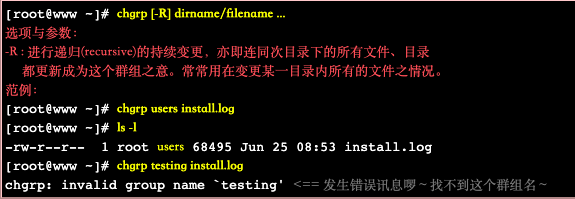

## 学会使用command+space调出聚焦搜索
terminal 终端（也可以使用其调用其他软件）

## 浏览器
Chrome浏览器，搜索引擎使用Google（多使用英文搜索）

## 常用命令行
命令行 | 作用
--- | ---
pwd             | 知道自己所在目录
cd              | 切换到home目录
cd .            | 当前目录
cd ..           | 切换到上一级目录
cd + example    | 切换到“example”目录下

<br>

查看文件信息 | 作用
--- | ---
ls              | 查看当前目录下到文件和文件夹
ls -a (all)     | 现实隐藏文件及文件夹
ls -l (long)    | 显示更多信息
ls -h (humanity)| 友好显示方式

<br>

文件、文件夹 | 作用
--- | ---
touch           | 创建一个新文件
rm (remove)     | 删除一个文件
cp (copy)       | 复制一个文件
mv (move)       | 移动或者重命名一个文件
mkdir           | 创建一个新文件夹
mkdir -p        | 依次创建目录下的文件夹
rm -r           | 删除一个文件夹
cp -r           | 复制一个文件夹
mv              | 移动或者重命名文件夹

<br>

其他 | 作用
--- | ---
history         | 查看历史命令记录
cat             | 查看文本文件内容
grep            | 过滤内容

## 命令行快捷键
```
//C ->代表control
//M ->代表option
```
快捷键 | 作用
--- | ---
C-a             | 光标移动到行首
C-e             | 光标移动到行尾
C-f             | 光标右移一个字符
C-b             | 光标左移一个字符
M-f             | 光标右移一个单词
M-b             | 光标左移一个单词
C-d             | 删除光标下的字符
M-d             | 删除光标右边单词
C-w             | 删除光标左边的单词
C-k             | 删除光标右边的所有内容
C-u             | 删除整行内容
C-p             | 上一条执行的命令
C-n             | 下一条执行的命令（需要先执行C-p才可使用）
C-r             | 搜索之前执行的命令

## 编辑器
常用的编辑器有sublime、Atom、VS-code、vim、emacs等，但是无论使用哪一个以下操作快捷键一定要熟悉
- 打开文件(command+O)<br>关闭文件(command+W)
- 光标移动（见上述）
- 删除一行，删除一个词（见上述）
- 复制粘贴（command+C、command+V）

暂定使用vscode(操作sublime较为简单)

## brew (软件管理)
命令行 | 作用
--- | ---
brew list       | 查看已经安装的软件
brew install    | 安装软件
brew uninstall  | 卸载软件
brew search     | 查询可供安装的软件


## git
远端 (github) | 本地(mac)
--- | ---
账号(注册，一次完成) | 认证(每台电脑需要一次)
创建项目|操作项目 管理项目

### 如何在github上创建、修改项目
1. 首先在git网站上创建一个远端项目
1. 使用 ``` git clone ``` 命令在当前目录下下载远端项目
1. 在下载的文件上进行修改，更改本地文件后使用 ``` git add ``` 命令将你的变更进行缓存<br>
（现阶段使用 ``` git add . ```）
1. 使用``` git commit ```将变更固定下来<br>
（现阶段使用``` git commit -m "你的叙述" ```方便下次查找）
1. 使用 ``` git push ``` 将本地项目同步到服务器中去
1. 可以使员工``` git status ```查看git状态

注：使用中文名出现乱码时，使用
```
git config --global core.quotePath false
```

## linux相关

文件拥有者可以设置文件属性即不同使用者使用权限<br>
群组中可以设置同一群组中成员对文件的权限，同时也可以阻止非本群组成员的访问

注：root权限最大

linux中
- 一般身份使用者以及root信息存储在/etc/passwd中
- 个人密码存储在/etc/shadow中
- 组名存储在/etc/group中


### 1、了解 " -rwxr-xr-- "含义<br>
将其分解为以下几个部分<br>
[ - ][ rwx ][ r-x ][ r-- ]

第一个[ - ]代表文件或目录
- 当为[ d ]时为目录
- 当为[ - ]则是文件，例如上表档名为『install.log』那一行；
- 若是[ l ]则表示为连结档(link file)；
- 若是[ b ]则表示为装置文件里面的可供储存的接口设备(可随机存取装置)；
- 若是[ c ]则表示为装置文件里面的串行端口设备，例如键盘、鼠标(一次性读取装置)。

``` r-read w-write x-execute ```<br>

第二个[ rwx ]为文件拥有者权限<br>
‘r’ 代表可读<br>
‘w’ 代表可写<br>
‘x’ 代笔可执行<br>

第三个[ r-x ]为同群组权限<br>
‘r' 代表可读<br>
‘-‘ 代表不可写<br>
‘x’ 代表可执行<br>

第四个[ r-- ]
‘r' 代表可读<br>
‘-‘ 代表不可写<br>
‘-’ 代表不可执行<br>

注：rwx顺序不变，没有该权限则会变成'-'

### 2、上图中 ‘2’代表有多少档名连接到此节点！！
目录树是使用文件名来记录， 每个档名就会连结到一个i-node

### 3、第三栏表示这个文件的【拥有者账号】

### 4、第四栏表示这个文件的所属群组
所属群组权限在1中有介绍

### 5、第五栏为这个文件大小，单位：bytes

### 6、第六栏为这个文档建档日期或者修改日期
如果这个文件被修改的时间距离现在太久了，那么时间部分会仅显示年份而已<br>
使用```ls -l --full-time```能够显示出完整的时间格式了包括年、月、日、时间

### 7、第七栏为这个文件档名
若档名之前多一个' . '，则代表这个文件为『隐藏档』

## 文件权限重要性
1. 系统保护功能
    e.g：重要文件例如/etc/shadow，只有root才能读取，因此应该为[-rw-------]
1. 团队开发软件或数据共享功能
    e.g：若团队中有成员需要对文件进行操作，便要具有可读，可写，可执行，因此为[-rwxrwx---]
1. 未将权限设定妥当的危害
    e.g：系统可能会被其他人恶意篡改

## 改变文件属性以及权限
命令行 | 作用
---| ---
chgrp (change group) | 改变文件所属群组
chown (change owner) | 改变文件拥有者
chmod (change mode) | 改变文件权限，SUID，SGID，SBIT等特性

### 1.改变文件所属群组——chgrp

被改变的组名一定要在/etc/group，否则显示错误


users本身存在于/etc/group中，而testing不存在，使用chgrp更改install.log文件所属群组。结果如上图所示，users更改成功，而testing更改失败，提示找不到群组名

### 2.改变文件拥有者——chown

被改变的用户名一定要在/etc/passwd中，同时，此命令还可以更改群组名称。


结果如图所示

注：chown也可以使用```chown user.group file```，亦即在拥有者与群组间加上小数点『.』也行！ 不过很多朋友设定账号时，喜欢在账号当中加入小数点(例如vbird.tsai这样的账号格式)，这就会造成系统的误判了！ 所以我们比较建议使用冒号『:』来隔开拥有者与群组啦！此外，chown也能单纯的修改所属群组呢！ 例如```chown .sshd install.log```就是修改群组。就是那个小数点的用途！

chgrp和chown经常在将文件复制给他人时使用

### 3.改变权限——chmod
可以使用数字或者符号进行权限变更，linux中

- r:4
- w:2
- x:1

#### 3.1 chmod使用数字变更权限<br>

1、例如，将.bashrc这个文件所有权限都设置为启用，操作如图所示

2、将.bashrc这个文件改为-rw-r--r--<br>
指令为``` chmod 644 .bashrc ```

#### 3.2 chmod使用符号变更权限<br>
- u-user
- g-group
- o-others
- a-all
- +(加入)
- -(除去)
- =(设定)

1、例如将.bashrc这个文件设置为-rwxr-xr-x


2、例如并不知道.bashrc文件权限，要使每个人都具有写入这一权限


3、若去掉所有人可执行权限


