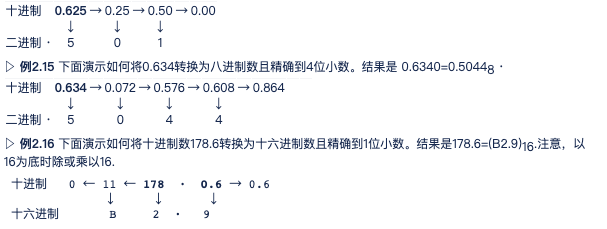

# 2.数字系统

图灵机

同一个程序，相同输入相同输出

记住:  
- A : 10  1010
- C : 12  1100
- F : 15  1111
- 255 : 11111111
- 65535 : 11111111 11111111

**二进制-十六进制转换**

--------------------------------------

数字系统(或数码系统)定义了如何用独特的符号来表示一个数字。在不同的系统中，一个数字有不同的表示方法。

数字系统可以分为两类位置化系统和非位置化系统

## 位置化数字系统

位置化数学系统中，数字中符号所占据的位置决定了其表示的值。在该系统中，数字表示为

±(Sk-1...S2S1S0.S-1S-2...S-l)b

其值为

n = ±Sk-1×bk-1+...S1×b1+S0×b0+S-1×b-1+S-2×b-2+...+S-l×b-l

其中，S是一套符号集；b是底(或基数)，它等于S符号集中的符号总数，其中S1和Sk是代表分数部分或整个数字的符号。注意我们使用的表达式可以从右边或从左边扩展。也就是说，b的幂可以从一个方向由0到k-1，还可以从另一个方向由-1到-l。b的非负数幂与该数字的整数部分有关，而负数幂与该数字的小数部分有关。土符号表示该数字可正可负。本章我们将学习一些位置化数字系统。

### 十进制系统(以10为底)

整数(没有小数点)
实数(带有小数点)

我们需要知道可以用数码量表示的十进制整数的最大值。答案是Nmax=10k-1。例如，如果k=5，那么这个最大值就是Nmax=105-1 = 99 999

### 二进制系统

数码k表示的二进制整数的最大值是Nmax=2k-1。例如，如果k=5，那么这个最大值就是Nmax=25-1=31

### 十六进制系统

尽管二进制系统用于存储计算机数据，但是它并不便于在计算机外部表示数字，因为与十进制符号相比，二进制符号过长。然而，十进制不像二进制那样直接显示存储在计算机中的是什么。在二进制位数和十进制数字之间没有显然的关系。它们之间的转换也不快捷。

为了克服这个问题，发明了两种位置化系统十六进制和八进制。

数码k表示的十六进制整数的最大值是Nmax=16k-1。例如，如果k=5，那么这个最大值就是
Nmax=165-1=1048 575

实数可以使用十六进制表示，但是不常见

### 八进制系统

人们发明的与二进制系统等价并用于计算机外部的第二种系统是八进制系统

数码k表示的八进制整数的最大值是Nmax=8k-1。例如，如果k=5，那么这个最大值就是 Nmax=85=32 767.

### 十进制进制转换

1. 任意进制转换到十进制
……

1. 十进制转换到其他进制
整数部分
……
小数部分
示例：

连续乘以当前进制数，将整数部分写下来，小数部分移到右边。当小数部分为0,或达到足够的位数时结束。结果是0.625 =(0.101)2。

1. 数码的数量
在把数字从十进制转换到其他进制之前，我们需要知道数码的数量。通过k=[logbN]的关系，我们总可以找到一个整数的数码的数量，其中[x]意味着最小的整数大于或等于x(这也称为x的高限)，N是该整数的十进制值。例如，我们可以找到十进制数234在所有4个系统中的位数，如下所示: 
a. 十进制: kd = [log10234] = [2.37] = 3，显而易见。 
b. 二进制：kb = [log2234] = [7.8] = 8，因为234 = (11101010)2，所以正确。 
c. 八进制：ko = [log8234] = [2.62] = 3，因为234 = (352)8，所以正确。 
d. 十六进制：kh = [log16234] = [1.96] = 2，因为234 = (EA)16，所以正确。

### 二进制-十六进制转换
...

### 八进制-十六进制转换
...

### 八进制-十六进制转换
需要通过二进制作为媒介

### 数码的数量
从一个底向另一个转换中，如果我们知道源系统数码的最大数量，就能知道我们在目标系统中所需用到的数码的最小数量。例如，如果在源系统中我们知道最多使用6个十进制数码，那么在目标系统中我们就知道要使用二进制数码的最少数量。通常，假设在以b为底的系统中使用k个数码，在源系统中显示的最大数是bk1-1。我们可在目标系统中拥有的最大数是b2x-1。因此时b2x-1 >= b1k-1。这意味着b2x > = b1k，也就是:

*x≧k×(logb1/logb2)或x=[k×(logb1/logb2)]*

## 非位置化数字系统

非位置化数字系统仍然使用有限的数字符号，每个符号有一个值。但是符号所占用的位置通常与其值无关——每个符号的值是固定的。为求出该数字的值，我们把所有符号表示的值相加。该系统数字表示为:

Sk-1...S2S1S0·S-1S-2...S-l

其值为:

±Sk-1+...+S1+S0 + S-1+S-2+...+S-l

(需要仔细思考)

