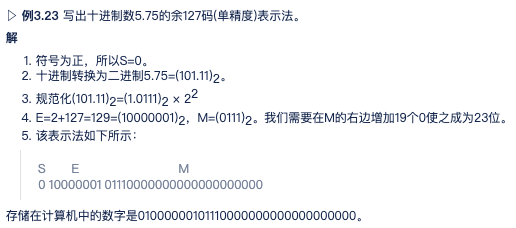
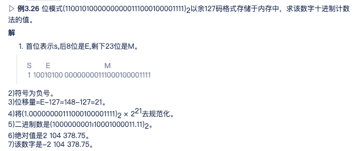
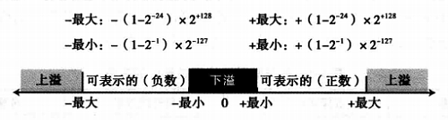
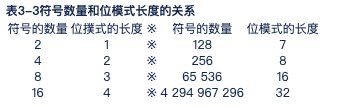

# 数据存储

## 数据类型
1. 数字
1. 文本
1. 音频
1. 图像
1. 视频

**计算机行业中，多媒体用来定义包含以上五种类型的信息**

## 计算机内部数据

所有计算机外部数据类型都采用统一的数据表示转换后存入计算机中，当数据从计算机中输出时在还原。这种通用的格式叫做位模式

### 位

1. 位(bit，binary digit)
    储存在计算机中最小单位，是0和1。位代表设备某一状态，这些设备只能处于两种状态之一，1是合上，0是断开。电子开关就是一个位。一个开关只能存储一个位信息。如今，计算机使用双态设备来存储数据。

1. 位模式
    位了表示数据不同类型，应该使用**位模式**，它是一个序列，也被称为位流。我们需要存储一个由16个位组成的位模式，那么需要16个电子开关。如果我们需要存储1000个位模式，每个16位，那么需要16 000个开关。通常长度为8的位模式被称为1字节。有时用字这个术语指代更长的位模式。

1. 数据压缩
    为占用较少的内存空间，数据在存储到计算机之前通常被压缩。15章节介绍

1. 错误检测和纠正
    另一个与数据有关的话题是在传输和存储数据时的错误检测和纠正。

## 存储数字

在存储到计算机内存中之前，数字被转换到二进制系统。但仍有两个问题需要解决：

    1. 如何存储数字的符号。
    2. 如何显示十进制小数点。

小数点，计算机使用两种不同的表示方法定点和浮点。第一种用于把数字作为**整数存储**——没有小数部分，第二种把数字作为**实数存储**——带有小数部分。

### 整数存储

整数是完整的数字(即没有小数部分)。整数被当作小数点位置固定在最右边。因此，定点表示法用于存储整数

用户(或程序)可能将整数作为小数部分为0的实数存储，为了更有效地利用计算机内存，**无符号**和**有符号**的整数在计算机中存储方式是不同的。 
`注：整数正常使用定点表示法存储在内存中。 `

#### 1.无符号表示

无符号整数是只包括零和正数的非负整数。它的范围介于0到无穷大之间。计算机都定义了一个常量，称为最大无符号整数，它的值是(2n-1)。这里n就是计算机中分配用于表示无符号整数的二进制位数。即几位内存。如：4位内存，n=4

(1)存储无符号整数
- 首先将整数变成二进制数。
- 如果二进制位数不足n位，则在二进制数的左边补0,使它的总位数为n位。如果位数大于n，该整数无法存储。

(2)译解无符号整数 
输出设备译解内存中位模式的位串并转换为一个十进制的无符号整数。

(3)溢出
计算机仅仅会保存右边的n位(n为计算机几位内存)

(4)无符号整数的应用
- 计数 当我们计数时，不需要负数。可以从1(有时0)开始增长。
- 寻址 有些计算机语言，在一个存储单元中存储了另一个存储单元的地址。地址都是从0(存储器的第一个字节)开始到整个存储器的总字节数的正数，在这里同样也不需要用到负数。因此无符号整数可以轻松地完成这个工作。
- 存储其他数据类型 我们后面将谈到的其他数据类型(文本、图像、音频和视频)是以位模式存储的，可以翻译为无符号整数。

#### 正负数表示
在有效范围内(0到2n-1)分成两个相等的范围前半个表示正整数，后半个表示负整数。

#### 符号加绝对值表示法

用符号加绝对值格式存储一个整数，需要用1个二进制位表示符号(0表示正，1表示负)。这样就使得最大数值为无符号整数的一半。其范围为-(2n-1-1)至+(2n-1-1)

(1)符号加绝对值表示法的溢出

(2)符号加绝对值表示法的应用

符号加绝对值表示法不用于存储整数，而用于存储部分实数。 
符号加绝对值表示法通常用于采样模拟信号，例如，音频。

#### 二进制补码表示法

反码：简单反转各个位

补码：从右往左运算，将右边复制，直到有1被复制后，剩余位数取反码。例如： 
原码：0 0 1 1 0 1 0 0  
补码：1 1 0 0 1 1 0 0  
从右往左运算

注：连续进行两次补码运算可得到原来的整数

以二进制补码存储整数：将整数变成n为二进制数，如果是0或者正数数，原样存储，负数以补码形式存储。

以二进制补码还原整数：如果最左位是1，计算机取其补码，最左位为0，不变。然后将其变为十进制数。

二进制补码表示法溢出(仔细思考)

二进制补码表示法的应用：计算机中用于存储整数的标准表示法

## 实数

实数是带有整数部分和小数部分的数字。固定小数点的表示法可用于表示实数，但结果不一定精确或达不到需要的精度。

 - 带有很大的整数部分或很小的小数部分的实数不应该用定点表示法存储。

1. 浮点表示法(对应十进制的科学计数法)
    用于维持正确度或精度的解决方法是使用浮点表示法。该表示法允许小数点浮动我们可以在小数点的左右有不同数量的数码。使用这种方法极大地增加了可存储的实数范围：带有很大的整数部分或很小的小数部分的实数可以存储在内存中了。在浮点表示法中，无论十进制还是二进制，一个数字都由3部分组成 
    第一部分：符号(正负号) 
    第二部分：位移量(科学计数法的指数) 
    第三部分：定点数(科学计数法前的数字) 

2. 规范化
    为了使表示法的固定部分统一，科学计数法(用于十进制)和浮点表示法(用于二进制)都在小数点左边使用了唯一的非零数码，这称为规范化。十进制系统中的数码可能是1～9,而二进制系统中该数码是1。在下面，d是非零数码，x是一个数码，y是0或1。

3. 符号、指数和尾数
    我们只存储了一个数的三部分信息符号、指数和尾数(小数点右边的位)

    尾数是指小数点右边的二进制数。它定义了该数的精度。尾数是作为无符号整数存储的。如果我们把尾数和符号一起考虑，则可以说这个组合是作为符号加绝对值格式的整数存储的。

4. 余码系统(需仔细思考)
    在余码系统中，正的和负的整数都可以作为无符号数存储。为了表示正的或负的整数，一个正整数(称为一个偏移量)加到每个数字中，将它们统一移到非负的一边。这个偏移量的值是2m-1-1，m是内存单元存储指数的大小。

5. IEEE标准
    电气和电子工程师协会(IEEE)已定义了几种存储浮点数的标准。常用的为单精度和双精度。

    参数 | 单精度 | 双精度
    :--: | :--: | :--: 
    内存单元大小(位) | 32 | 64
    符号大小(位) | 1 | 1
    指数大小(位)| 8 | 11
    尾数大小(位) | 23 | 52
    偏移量(整数) | 127 | 1023

6. IEEE标准浮点数存储
    一个实数可以存储为IEEE标准浮点数格式,步骤如下:

    1. 在S(符号)中存储符号(0或1)。
    1. 将数字转换为二进制。
    1. 规范化。
    1. 找到E(指数)和M(尾数)的值。
    1. 连接S、E和M。

    

7. 还原IEEE标准浮点数

    步骤如下：
    1. 找到S、E和M的值。
    2. 如果S=0，将符号设为正号，否则设为负号。
    3. 找到位移量(E-127)。
    4. 对尾数去规范化。
    5. 将去规范化的数字变为二进制以求出绝对值。
    6. 加上符号。

    

1. 上溢和下溢

    浮点数不能存储很大的值以及很小的值，会出现上溢和下溢的情况，如图所示
    

1. 存储0

    符号，指数，尾数都设置为0

1. 截断错误

    原始数字与还原后数字的差异称为截断错误。

## 储存文本
在任何语言中，文本的片断是用来表示该语言中某个意思的～系列的符号。

位模式需要的符号数取决于语言集中到底有多少不同的符号。例如，如果要创建的某个虚构的语言仅仅使用大写英文字母，则只需要26个符号。相应地，这种语言的位模式至少需要表示26个符号。

位模式的长度取决于符号的数量，是以对数形式决定的，果需要2个符号，位模式长度将是1位(log22=1)，如果需要4个符号，长度将是2位(log24=2)。其关系为：

### 代码
不同的位模式集合被设计用于表示文本符号。其中每一个集合我们称之为代码。

1. ASCII
    美国国家标准协会(ANSI)开发了一个被称为美国信息交换标准码(ASCII)的代码。该代码使用7位表示每个符号。即该代码可以定义27=128种不同的符号。用于表示ASCII码的完整位模式可见附录A.如今ASCII是Unicode的一部分，下面将要讨论。

1. Unicode
    硬件和软件制造商联合起来共同设计了一种名为Unicode的代码，这种代码使用32位并能表示最大达232=4 294 967 296个符号。代码的不同部分被分配用于表示来自世界上不同语言的符号。其中还有些部分被用于表示图形和特殊符号。Unicode符号的简集见附录A.如今ASCII是Unicode的一部分。

1.  其他编码

## 存储音频
音频表示声音或音乐。音频是不可数的。音频是随时间变化的实体，我们只能在每一时刻度量声音的密度。当我们讨论用计算机内存存储声音时，我们的意思是存储一个音频信号的密度，例如，每隔一段时间(一秒钟，一小时)来自麦克风的信号。

### 采样
每秒40 000个样本的采样率对音频信号来说是足够好的。

### 量化
量化指的是将样本的值截取为最接近的整数值的一种过程。

### 编码
量化的样本值需要被编码成位模式。一些系统为样本赋正值或负值，另一些仅仅移动曲线矗的区间从而只赋正值。换言之，一些系统使用无符号整数来表示样本，而另一些使用有符号的整数来做。但是，有符号的整数不必用在二进制补码中，它们可以是符号加绝对值的值。最左边的位用于表示符号(0表示正值，1表示负值)，其余的位用于表示绝对值。

1. 每位样本
对于每个样本系统需要决定分配多少位。尽管在过去仅有8位分配给声音样本，现在每样本16、24甚至32位都是正常的。每样本位的数量有时称为位深度。

1. 位率
如果我们称位深度或每样本位的数量为**B**,每秒样本数为**S**,我们需要为每秒的音频存储S x B位。该乘积有时称为位率R.例如，如果我们使用每秒40 000个样本以及每样本16位, 位率是 R = 40 000 × 16= 640 000 b/s=640 KB/s。

### 声音编码标准
标准为：MP3(MPEG Layer 3),该标准是用于视频压缩方法的MPEG(动态图像专家组)标准的一个修改版。它采用每秒44 100个样本以及每样本16位。结果信号达到705 600 b/s的位率，再用去掉那些人耳无法识别的信息的压缩方法进行压缩。

## 存储图像
使用光栅图或矢量图。

### 光栅图
1. 解析度
    在图像扫描中，我们要决定对于每英寸的方块或线条需要记录多少像素。在图像处理中的扫描率称为解析度。
2. 色彩深度
    (1)真色彩
    用于像素编码的技术之一称为真彩色，它使用24位来编码一个像素。在该技术中，每个三原色(RGB)都表示为8位。因为该技术中8位模式可以表示0～255之间的一个数，所以每种色彩都由0～255之间的三维数字表示。表3-4显示了该技术中用于一些颜色的3个值。
    (2)索引色
    真彩色模式使用了超过1600万种的颜色。许多应用程序不需要如此大的颜色范围。索引色(或调色板色)模式仅使用其中的一部分。在该模式中，每个应用程序从大的色彩集中选择一些颜色(通常是256种)并对其建立索引。对选中的颜色赋一个0～255之间的值。
3. 图像编码标准
    几种用于图像编码的实际标准正在使用中。JPEG(联合图像专家组)使用真彩色模式，但压缩图像来减少位的数量(参见第15章)。另一方面，GIF(图形交换格式)使用索引色模式。

### 矢量图
矢量图图像编码方法并不存储每个像素的位模式。一个图像被分解成几何图形的组合，例如，线段、矩形或圆形。每个几何形状由数学公式表达。例如，线段可以由它端点的坐标描述，圆可以由它的圆心坐标和半径长度来描述。矢量图是由定义如何绘制这些形状的一系列命令构成的。

## 存储视频
视频是图像(称为帧)在时间上的表示。(了解图像如何存储)

