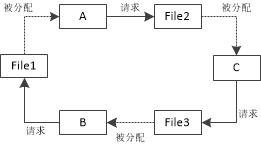
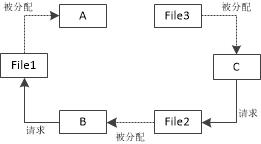

## 上午作业(计算机网络)

### 复习题

8.在周末，Alice经常要通过她的笔记本电脑访问保存在办公室台式机上的文件。上周她在办公室台式机上安装了一个FTP服务器程序的副本，在家里的笔记本电脑上安装了FTP客户机程序的副本。她很失望周末无法访问到她的文件。这可能出现什么差错了?
    

    使用了FTP建立局域网但是并没有将外部端口和内网地址对应起来，外网无法访问到内网当中
    

9.大多数安装在个人计算机上的操作系统带有几个客户端进程，但通常没有服务器进程，请解释原因。

    因为个人计算机不用作服务器，服务器应设有有专门的服务器操作系统。

浏览器输入 www.baidu.com并回车到底发生了些什么？？

    1. 查找 baidu 对应IP
    2. 浏览器给 baidu 服务器发送一个 HTTP 请求
    3. baidu服务器处理请求
    4. baidu服务器返回HTML响应

### 练习题

3.假设连接到因特网的主机在2010年是5亿台。这个数字以每年20%的速度增长，到2020年主机数量是多少?

    5 * 10^8 * 1.2^10 = 3.09587 * 10^9

9.较16位端口地址(0〜65535)和32位IP地址(0〜4294967295)的范围，为什么我们需要IP地址有如此大的范围，但端口号却相对范围小呢?

    端口号是服务器端的，而IP地址是用户的，不同用户可以使用不同的IP地址去访问同一个服务器，因此服务器端口号较少，IP地址较多。

## 下午作业(操作系统)

### 复习题：

9.为什么操作系统需要队列?

    便于管理进程，合理地调度资源

10.死锁和饿死有何区别?

    死锁是程序之间在抢占资源，各自又不释放资源，一直在等待其他程序释放资源
    饿死是一个程序所需资源被全部占用，该程序得不到资源运行

### 练习题

9.三个进程(A、B和C)同时运行，进程A占用File1但需要File2。进程B占用File3但需要File1。进程C占用File2但需要File3。为这几个进程画一个框图。这种情况是不是死锁?

是死锁

10.三个进程(A、B和C)同时运行，进程A占有File1，进程B占有File2但需要File1,进程C占有File3但需要File2。为这几个进程画一个框图。这种情况是不是死锁?如果不是，说明进程怎样最后完成它们的任务。

不是死锁，程序A首先释放文件File1，程序B请求File1，得到File1后，完成任务，释放File2，此时程序C请求File2，得到File2后完成任务

