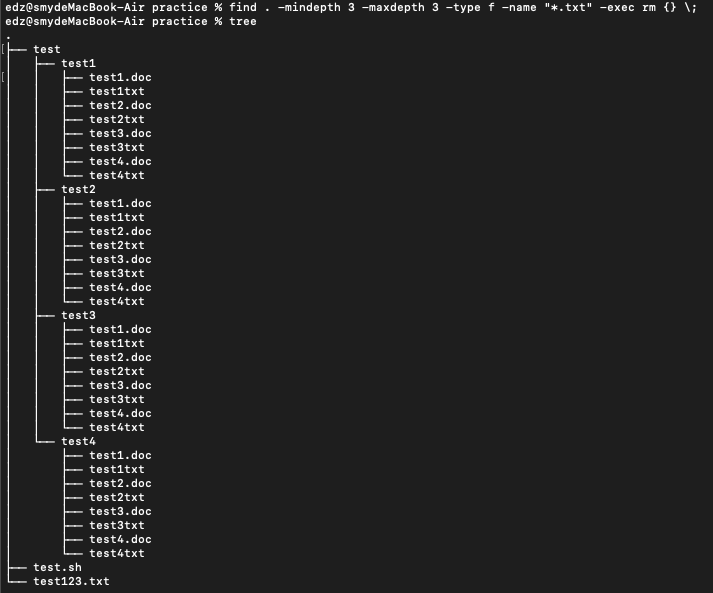
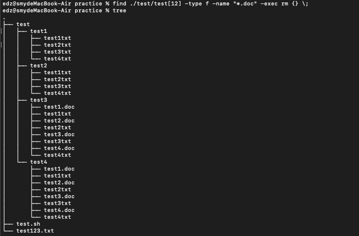

# 基础测试题

使用命令为(任选一条)
1. ` find . -mindepth 3 -maxdepth 3 -type f -name "*.txt" -exec rm {} \; `

1. ` find . -mindepth 3 -type f -name "*.txt" -exec rm {} \; `

1. ` find ./test/test[1234] -type f -name "*.txt" -exec rm {} \; `

上述命令都可以达到预期效果

结果如下


# 挑战题

使用命令为<br>
` find ./test/test[12] -type f -name "*.doc" -exec rm {} \; `

结果如下



## grep正则表达式

### grep命令
e.g ` grep -n '查找内容(可使用正则表达式)' 查找的文件 `

- -v 排除匹配内容
- -E 支持扩展的正则表达式
- -i 忽略大小写
- -o 只显示匹配的内容
- --color = auto 显示匹配颜色
- -n 显示行号
- -w 匹配的文本只能是单词，而不是一部分
- -c 显示有多少行被匹配到了，而不是显示匹配到的内容
- -A n：显示匹配到的字符串所在的行及其后n行(after)
- -B n：显示匹配到的字符串所在的行及其前n行(before)
- -c n：显示匹配到的字符串所在的行及其前后n行(context)

正则表达式是一套处理大量字符串所定义的规则以及方法

使用正则表达式这些特殊字符，能够快速过滤、替换需要的内容

### grep正则表达式 

- ^：例如 ^word    以word为开头内容
    <br>

- $：例如 word\$   以word结尾的内容
    <br>

- ^$：表示空行
    <br>

- .：表示且只能代表任意一个字符(当前目录，加载文件)
    <br>


- *：重复0次或多次前面的一个字符，不代表所有
    例如，` go*g `，表示'g'和'g'之间有着0个或者多个o
    再比如` goo*g `，表示'go'和'g'之间有着0个或者多个o，也就是说至少存在一个o
    <br>

- ?：表示重复0次或者1次前面的字符
    <br>

- +：表示重复1次或者多次前面的字符
    <br>

- .*：匹配所有的字符
    例如` g.*g `，代表以g开头，以g结尾，中间为任意数量的任意字符
    <br>

- ^.*：任意多个字符开头
    <br>


- [a-z]：匹配一个字符，匹配字符集合内任意一个字符[a-z]
    例如
    ` [a-z]oo `指第一个字符为[a-z]
    ` ^[A-Z] `指以大写字母为开头
    ` ^[^0-9] `代表第一个字符不是数字
    ^ 符号，在字符类符号(括号[])之内与之外是不同的！ 在 [] 内代表『反向选择』，在 [] 之外则代表定位在行首的意义
    <br>

- [abc]：匹配一个字符，字符必须是abc中的一个
    <br>

- [^abc]：^在中括号表示非，表示不包含a或者b或者c
    <br>

```
注：在shell中'{'与'}'有者特殊意义，因此要使用'\'来使其失去特殊意义
```

- ` \{n,m\} `：前一个字符，重复n到m次
    例如：` go\{2,5\}g `,表示'g'后面接2到5个o
    <br>

- ` \{n,\} `：至少n次
    <br>

- ` \{n\} `：正好n次
    <br>

- ` \{,m\} `：至多m次
    <br>

注：grep要转义 egrep(grep -E)不需要转义

e.g
如果想要查找包含'NE'或者'EA'的内容
` grep 'NE\|EA' example.txt `
` egrep 'NE|EA' example.txt `
` grep -E 'NE|EA' example.txt `
上述三条命令效果一样

